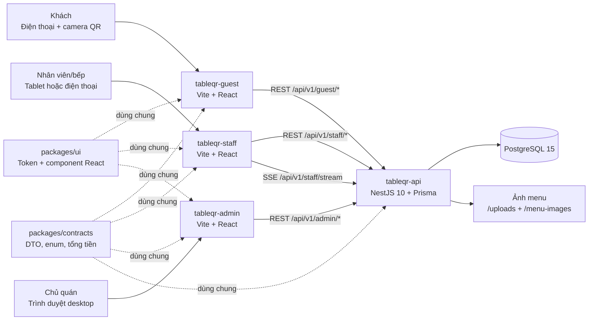
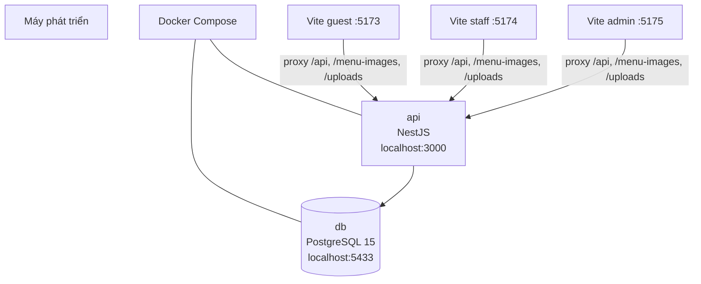
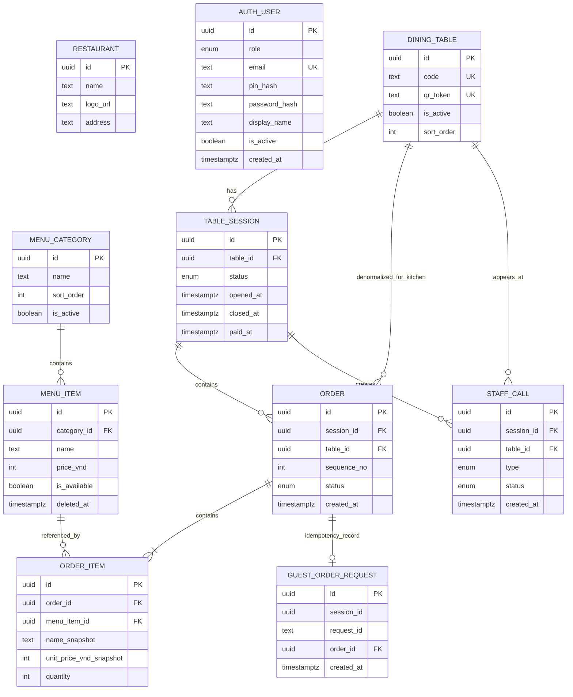

# 09 — Kiến trúc hệ thống hiện tại

Tài liệu này mô tả **code và hạ tầng đang có**, không phải kiến trúc SaaS đích. Thiết kế đa quán và tính phí nằm tại [10-saas-evolution.md](10-saas-evolution.md).

## 1. Bức tranh tổng thể



### Thành phần và trách nhiệm

| Thành phần | Trách nhiệm | Không làm |
| --- | --- | --- |
| `tableqr-guest` | Menu, giỏ hàng, gọi món, gọi nhân viên, xem đơn | Không có tài khoản khách hoặc logic tính giá phía client đáng tin cậy |
| `tableqr-staff` | Bảng bếp, bàn, thanh toán, reset phiên, nhận SSE | Không tự tạo/đồng bộ dữ liệu ngoài API |
| `tableqr-admin` | Đăng nhập chủ quán, menu, bàn/QR, cài đặt | Không đổi `qrToken` sau khi đã in |
| `tableqr-api` | Xác thực, kiểm tra nghiệp vụ, idempotency, transaction, SSE | Không phục vụ UI HTML |
| PostgreSQL | Nguồn dữ liệu bền vững, khoá/unique/index và lịch sử đơn | Không chứa file ảnh |
| `packages/contracts` | Contract dùng chung và phép tính tiền | Không phụ thuộc React/NestJS/DB |
| `packages/mock` | MSW + fixture chỉ cho phát triển/test UI | Không được có trong production bundle |

## Billing lifecycle local

`SA-08` đã thêm catalog `Plan`, `Subscription` và `SubscriptionCycle` vào PostgreSQL, cùng `EntitlementService` NestJS. Plan seed hiện là `starter-monthly` 100.000 VND/tháng, không giới hạn đơn; giá/feature được snapshot trên subscription. Service chuyển trial/kỳ hết hạn sang grace 7 ngày và sau đó `PAST_DUE`, đồng bộ status rút gọn ở `Restaurant`. `SA-09` bổ sung `PaymentProviderAdapter` (SePay là implementation đầu tiên).

`SA-11` đã gắn enforcement: `EntitlementGuard` toàn cục đọc metadata `@BillingAction` của route và gọi `EntitlementService.assert()`. Guard **mặc định từ chối** — route ghi không khai báo action sẽ lỗi ngay, nên không thể vô tình thêm endpoint bỏ qua entitlement. Đọc (`GET`/`HEAD`/`OPTIONS`), đăng nhập/đăng ký, webhook provider và `POST /staff/stream-ticket` không bị chặn; owner quá hạn vẫn tạo được payment intent. Guard tự resolve tenant: JWT cho staff/admin, capability guest (`X-Guest-Access` + RLS) cho route khách. Mốc grace/dunning ngày 1-3-7 ghi vào `SubscriptionEvent`; admin hiện banner ở mọi trang và `dunningNotices` trong `GET /admin/billing`.

## 2. Luồng vận hành chính

```mermaid
sequenceDiagram
  participant G as Guest app
  participant A as API
  participant D as PostgreSQL
  participant S as Staff app

  G->>A: GET /guest/tables/:qrToken
  A->>D: Tìm bàn, tạo/gắn TableSession OPEN
  D-->>A: session + menu
  A-->>G: bootstrap menu, table, session
  G->>A: POST /guest/sessions/:id/orders + X-Request-Id
  A->>D: Transaction: validate, snapshot giá, tạo Order
  D-->>A: Order mới
  A-->>S: SSE order.created
  A-->>G: Order (200; gửi lại cùng request ID trả cùng đơn)
  S->>A: PATCH /staff/orders/:id/status
  A->>D: Chuyển trạng thái hợp lệ
  A-->>S: SSE order.status_changed
```

`GET /guest/tables/:qrToken` hiện có side effect tạo phiên. Đây là quyết định tối ưu một round-trip 4G của MVP; cần kiểm tra prefetch bằng thiết bị thật ở `BE-13`.

## 3. Hạ tầng đang chạy



Compose khởi tạo database và API. Ba frontend hiện được Vite phục vụ cho development; proxy giữ frontend cùng origin với API trong quá trình này. Ảnh fixture được API phục vụ từ `/menu-images`, ảnh upload từ volume `tableqr-api/uploads` qua `/uploads`. Stack HTTPS tham chiếu trên một VM nằm ở [`../infra/production/`](../infra/production/README.md): Caddy phục vụ đúng ba hostname production, chỉ mở port 80/443, API/PostgreSQL không public, migration là one-shot service và upload dùng volume bền qua redeploy container. Đây là bước chuyển tiếp; `SA-02` còn phải thay upload bằng object storage managed và chạy backup/restore drill.

**Chưa phải production SaaS đã xác minh:** chưa chọn/triển khai VM, DNS và HTTPS thật từ Internet; cũng chưa có object storage, managed PostgreSQL/backup, Redis hay worker nền. Vì vậy điện thoại 4G vẫn không thể quét một URL `localhost`; các khoảng thiếu này là một phần của roadmap SaaS.

## 4. Xác thực và realtime

| Đối tượng | Cách định danh | Quyền |
| --- | --- | --- |
| Khách | `qrToken` trong URL → capability trả sau bootstrap | Không đăng nhập. API chỉ cho đọc/gửi đơn/gọi nhân viên khi có `X-Guest-Access`; DB chỉ lưu SHA-256 hash trong `guest_session_access`, nên UUID `sessionId` không phải quyền truy cập. Mỗi lần quét có capability riêng, không vô hiệu điện thoại khác trong cùng phiên. |
| Nhân viên | QR ghép một-lần (TTL 10 phút) → mã quán local + PIN → JWT role `STAFF` | QR chỉ chứa token ngẫu nhiên; server chỉ lưu hash và token bị vô hiệu sau claim. Orders, calls, bàn, thanh toán/reset |
| Chủ quán | Email/mật khẩu → JWT role `OWNER` | Admin menu, bàn và cài đặt |
| Realtime | REST đổi JWT lấy `stream_ticket` 60 giây, rồi `EventSource` gửi ticket đó trên query | Server phát `order.created`, `order.status_changed`, `call.created`, `session.closed`; client fallback polling sau 3 lỗi SSE |

Mật khẩu/PIN chỉ lưu hash bcrypt. Rate limit hiện là in-process qua Nest throttler và guest rate limiter; khi chạy nhiều API instance, các giới hạn này phải chuyển sang Redis trước khi scale ngang.

`X-Guest-Token` vẫn là client state/rate-limit local, không phải quyền. Quyền guest là `X-Guest-Access` capability theo phiên; API không dựa vào UUID "khó đoán". SSE không đặt access JWT trong URL: API cấp `stream_ticket` riêng, TTL 60 giây, chỉ hợp lệ cho endpoint stream.

## 5. ERD — database hiện tại



`Restaurant` và `AuthUser` đã mang tenant context: `AuthUser.restaurant_id` xác định quán trong JWT, và dữ liệu nghiệp vụ có `restaurant_id` để query scope theo quán. Runtime API dùng role PostgreSQL `tableqr_app` (không có `BYPASSRLS`); mỗi query nghiệp vụ đặt tenant GUC trong một transaction, còn owner chỉ dùng cho migration/seed. ERD ở phần này chưa liệt kê đầy đủ các cột tenant/composite foreign key; sơ đồ đích và quy tắc isolation cập nhật nằm tại [10-saas-evolution.md](10-saas-evolution.md).

### Ràng buộc quan trọng trong DB

| Ràng buộc | Tác dụng |
| --- | --- |
| `dining_table.code`, `dining_table.qr_token` unique | Không lẫn bàn và QR trong deployment một quán |
| partial unique `table_session(table_id) WHERE status = OPEN` | Không thể có hai lượt khách mở cùng một bàn |
| unique `order(session_id, sequence_no)` | Lần gọi món tăng liên tục trong một phiên |
| unique `guest_order_request(session_id, request_id)` | Retry/double-click không tạo đơn trùng trong 60 giây |
| `OrderItem` snapshot tên/giá | Đổi menu sau đó không đổi bill lịch sử |

## 6. Bản đồ code cần đọc

| Khi cần hiểu | Đọc đầu tiên |
| --- | --- |
| Shape DB thực tế | `tableqr-api/prisma/schema.prisma` và migration `20260809000000_init` |
| Quy tắc nghiệp vụ | [03-domain-model.md](03-domain-model.md), [01-business-flow.md](01-business-flow.md) |
| API | [04-api-contract.md](04-api-contract.md), controller/service tương ứng trong `tableqr-api/src` |
| Realtime | `tableqr-api/src/realtime/`, `tableqr-staff/src/lib/realtime.ts` |
| FE data layer | `tableqr-*/src/lib/api/` và TanStack Query hooks |
| Docker/runtime local | `tableqr-api/docker-compose.yml`, `tableqr-api/Dockerfile` |
