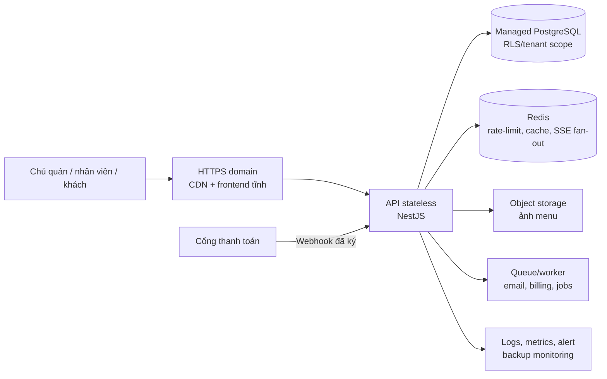
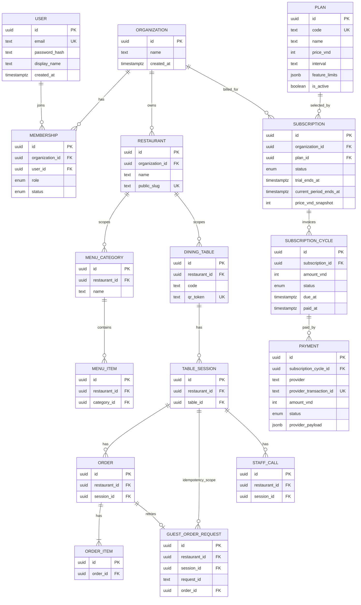
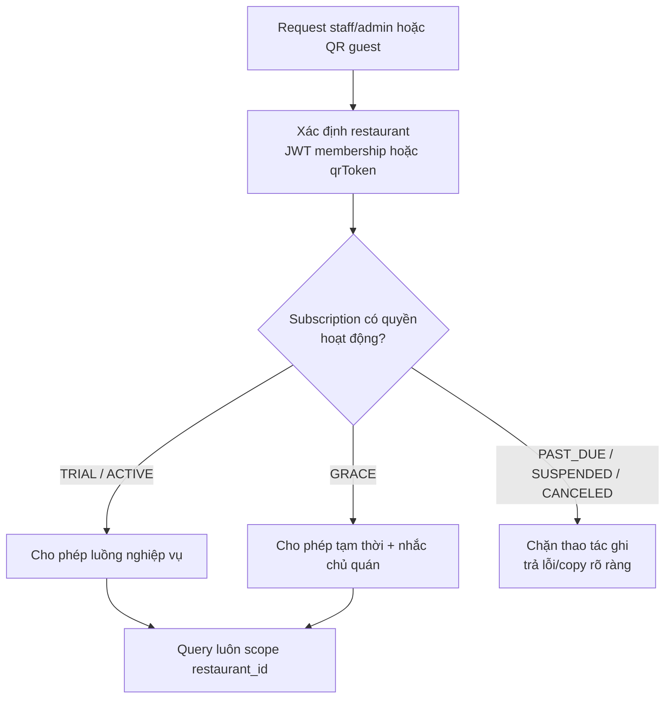

# 10 — Mở rộng SaaS, đa quán và thuê bao

Tài liệu này là thiết kế đích để TableQR phục vụ nhiều chủ quán trên một hệ thống. Nó **chưa thay đổi MVP đang chạy**. Chỉ bắt đầu migration khi `BE-13` và production foundation đã đạt; task theo thứ tự tại [../ai-tasks/13-saas-expansion.md](../ai-tasks/13-saas-expansion.md).

## 1. Quy tắc sản phẩm đã chốt

| Nội dung | Quy tắc phiên bản đầu |
| --- | --- |
| Người trả tiền | Chủ quán đăng ký tài khoản, tạo quán và là `OWNER` đầu tiên |
| Dùng thử | Miễn phí 2 tháng kể từ khi tạo quán; lưu `trialEndsAt` cố định thay vì tính lại trong mỗi request |
| Giá | 100.000 VND/tháng, không giới hạn số đơn |
| Khi hết trial | Chủ quán xem/trả tiền được; quyền vận hành phải theo `Subscription.status` và grace period được cấu hình |
| Khách QR | Không bị yêu cầu đăng nhập; chỉ được tiếp tục gọi món khi quán có quyền hoạt động |
| Tương lai | Giá/gói tính năng được dữ liệu hoá, không hard-code `100000` khắp UI/API |

**Quy ước đề xuất:** trial là hai tháng lịch (`registeredAt` + 2 tháng) và một quán chỉ được trial một lần. `trialEndsAt` được ghi lúc đăng ký để xử lý đúng tháng ngắn và không đổi nếu kế hoạch giá thay đổi sau này.

Các điều cần người quyết trước `SA-01`: cổng thanh toán, có/không grace period, chính sách quán quá hạn (chỉ khoá admin, hay dừng luôn guest order), quy tắc một chủ sở hữu có thể tạo bao nhiêu quán/chi nhánh.

## 2. Mục tiêu kiến trúc

Một deployment chung phục vụ nhiều quán. Mọi truy vấn nghiệp vụ phải có `restaurantId`/tenant context; không được tin ID do frontend gửi nếu không xác nhận membership. Dùng QR token global unique để xác định quán cho public guest route mà không lộ `restaurantId`.

## 3. Mô hình dữ liệu đích

### Vì sao có `Organization` trước `Restaurant`

Hiện một chủ quán chỉ cần một quán, nhưng `Organization → Restaurant` giúp mở nhiều chi nhánh sau này mà không phải viết lại billing hoặc danh tính. Bản đầu tạo một organization và một restaurant trong cùng transaction khi đăng ký. `Subscription` gắn với organization; nếu sau này có nhiều chi nhánh, chính sách gói quyết định tính theo organization hay location.

### Bảng/cột sẽ thêm hoặc đổi

| Nhóm | Thay đổi |
| --- | --- |
| Danh tính | Tách `AuthUser` hiện tại thành `User` toàn cục và `Membership`; role thuộc membership thay vì một cột toàn cục. Giữ migration/backfill cho owner và staff hiện có. |
| Tenant | Thêm `organization_id` vào `Restaurant`; thêm `restaurant_id` vào `DiningTable`, `MenuCategory`, `MenuItem`, `TableSession`, `Order`, `StaffCall` và bảng idempotency liên quan. |
| Uniqueness | Đổi `DiningTable.code` từ global unique sang unique `(restaurant_id, code)`; giữ `qr_token` global unique. Những index đọc thường xuyên bắt đầu bằng `restaurant_id`. |
| Billing | `Plan`, `Subscription`, `SubscriptionCycle`, `Payment`, `PaymentWebhookEvent` (idempotency/audit). Amount là VND integer; lưu `priceVndSnapshot`/`amountVnd`, không đọc lại giá gói cũ. |
| Vận hành | `AuditLog`, thời điểm tạo/cập nhật/soft-delete phù hợp. Không lưu số thẻ hoặc bí mật cổng thanh toán. |

`restaurant_id` được lặp lại trên `Order`/`TableSession`/`StaffCall` dù có thể suy ra qua bàn. Đây là denormalization có chủ đích để tenant filter, index, RLS và audit không phải join dài; API phải tự điền trong transaction, không lấy từ body client.

## 4. Quyền truy cập và billing enforcement

Không chặn mù tất cả GET ngay ngày hết hạn: chủ quán vẫn cần vào xem hoá đơn và thanh toán. Chính sách cụ thể (guest read/order, staff read/write, admin/billing) phải được chốt trong `SA-01`, sau đó thể hiện bằng một `EntitlementService` duy nhất, không rải `if subscription...` trong controller.

Webhook thanh toán phải: xác minh chữ ký, lưu raw event tối thiểu có che dữ liệu nhạy cảm, unique theo `provider_event_id`, xử lý idempotent trong transaction, và chỉ worker/API server-side mới cập nhật subscription.

## 5. Lộ trình migration không downtime lớn

1. **Production foundation:** domain HTTPS ổn định, secrets, backup/restore, object storage và observability trước khi mời quán thật.
2. **Mở rộng additive:** tạo các bảng identity/billing, thêm cột nullable `restaurant_id` và backfill toàn bộ dữ liệu hiện có vào default organization/restaurant. Chưa đổi endpoint.
3. **Dual-read/dual-write có kiểm soát:** service tự lấy tenant context; thêm composite unique/index, kiểm thử không thể đọc chéo tenant. Chỉ bỏ đường cũ sau khi đối soát.
4. **Onboarding:** public owner registration → email/password → organization + restaurant + owner membership + subscription `TRIAL` trong một transaction. Tạo sẵn menu/bàn mẫu; QR dùng hostname production cố định.
5. **Billing:** seed plan `starter-monthly` 100.000 VND, tạo cycle, tích hợp provider webhook, entitlement + dunning/grace. Đơn không có limit ở policy starter.
6. **Tiered plans:** `feature_limits`/entitlement thay vì hard-code. Migrate plan version/pricing không sửa subscription lịch sử.

Mỗi migration phải có backup, kiểm thử restore, `EXPLAIN` cho các query tenant-scoped, migration rehearsal trên dữ liệu copy, và rollback plan. Không chạy một migration biến đổi toàn bộ bảng lớn trong giờ phục vụ.

## 6. Ngoài phạm vi lần mở rộng đầu

- Không tự thu tiền từ thẻ; dùng cổng thanh toán có webhook.
- Không tính phí theo số đơn ở gói đầu.
- Không mở marketplace/đồng bộ ảnh giữa quán cho tới khi có consent, licensing và object storage chung.
- Không làm đa chi nhánh UI trước khi tenant isolation, subscription và onboarding an toàn.
