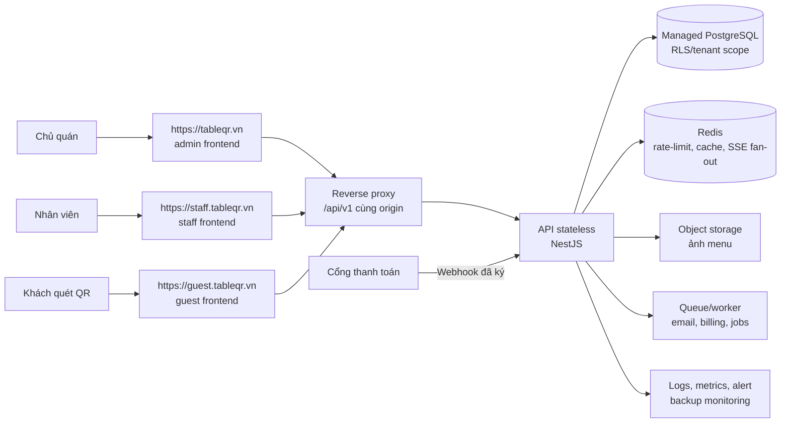
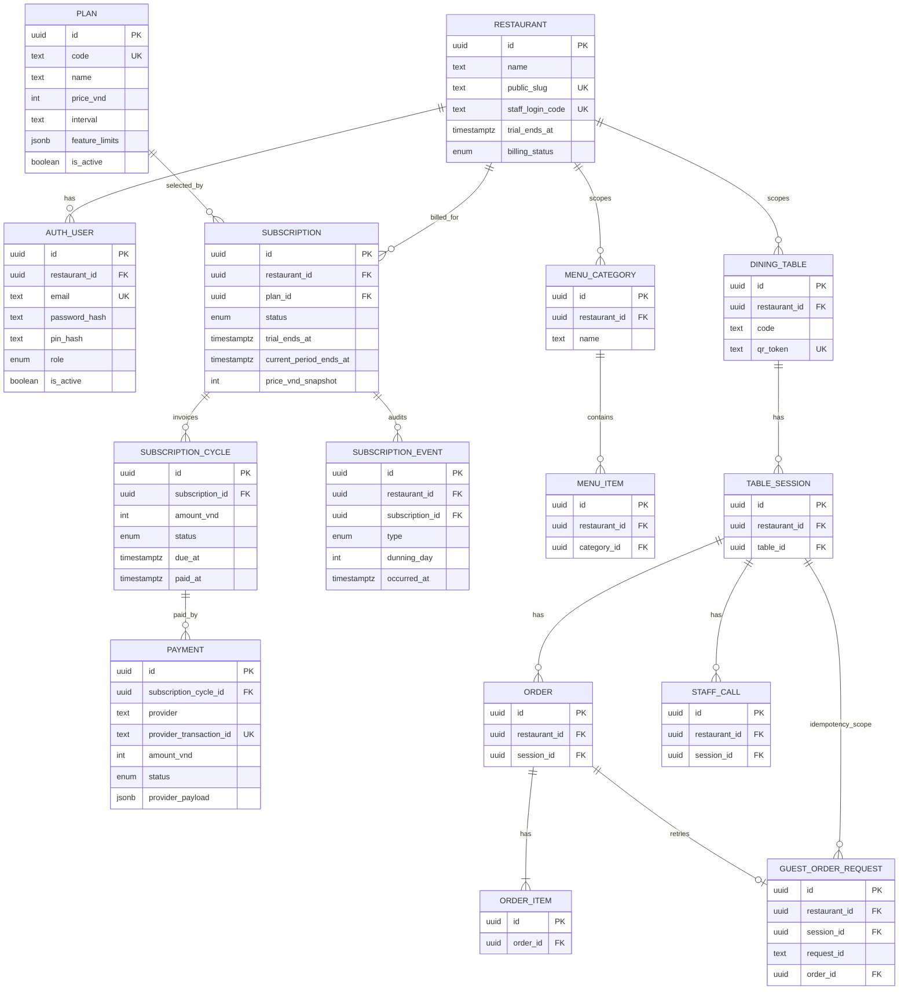
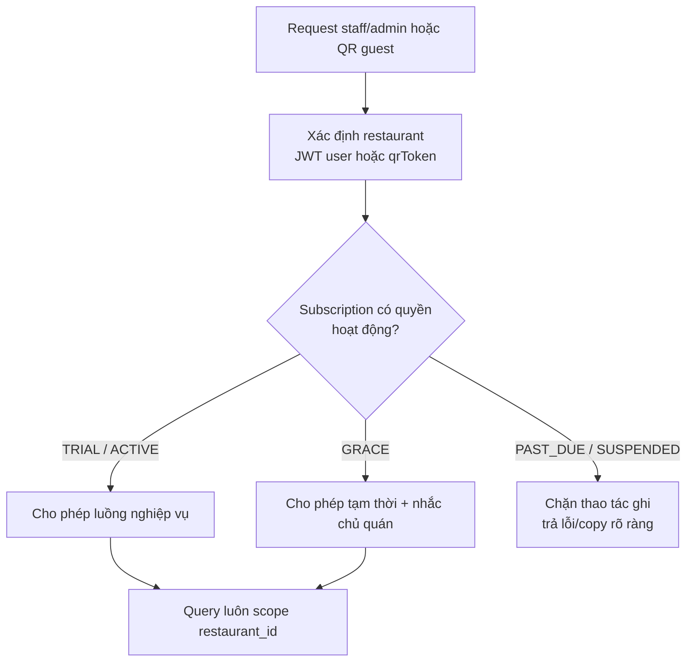

# 10 — Mở rộng SaaS, đa quán và thuê bao

Tài liệu này là thiết kế đích để TableQR phục vụ nhiều chủ quán trên một hệ thống. Theo quyết định người dùng ngày 2026-08-13, local database đã được reset để bắt đầu tenant foundation sớm: dữ liệu nghiệp vụ có `restaurant_id`, JWT mang tenant context, staff ghép tablet bằng QR rồi đăng nhập PIN và SSE scope theo quán. Kiểm tra với hai tenant đã chặn truy cập chéo; guest dùng capability hash thay vì UUID session; PostgreSQL có composite foreign key nên tự chặn quan hệ nghiệp vụ chéo quán; SSE dùng ticket 60 giây thay access JWT trên URL. Ngày 2026-08-15, `SA-03`…`SA-06` hoàn tất local: RLS, query audit và owner registration/onboarding đều đã qua regression. Task theo thứ tự tại [../ai-tasks/13-saas-expansion.md](../ai-tasks/13-saas-expansion.md).

## 1. Quy tắc sản phẩm đã chốt

| Nội dung | Quy tắc phiên bản đầu |
| --- | --- |
| Người trả tiền | Chủ quán đăng ký một tài khoản, tạo đúng một quán và là `OWNER` đầu tiên |
| Dùng thử | Miễn phí 2 tháng kể từ khi tạo quán; giai đoạn onboarding lưu `trialEndsAt` cố định trên `Restaurant`, rồi chuyển sang `Subscription` khi làm billing |
| Giá | 100.000 VND/tháng, không giới hạn số đơn |
| Khi hết trial | Bắt đầu grace period 7 ngày; trong thời gian này quán vẫn hoạt động và owner được nhắc thanh toán vào ngày 1, 3 và 7 |
| Khách QR | Không bị yêu cầu đăng nhập; chỉ được tiếp tục gọi món khi quán có quyền hoạt động |
| Tương lai | Giá/gói tính năng được dữ liệu hoá, không hard-code `100000` khắp UI/API |

Để giữ onboarding nhanh ở phiên bản đầu, account được kích hoạt ngay sau đăng ký; chưa có xác minh email. Endpoint đăng ký phải rate-limit nghiêm ngặt và không được làm lộ email đã tồn tại ngoài lỗi `EMAIL_ALREADY_IN_USE`. Xác minh email là hardening sau, không chặn tenant isolation.

**Quy ước đã chốt 2026-08-15:** trial là hai tháng lịch (`registeredAt` + 2 tháng) và một quán chỉ được trial một lần. `trialEndsAt` được ghi lúc đăng ký để xử lý đúng tháng ngắn và không đổi nếu kế hoạch giá thay đổi sau này.

`SA-06` đã triển khai `POST /public/owner-registration` với giới hạn 3 request/giờ. Transaction tạo quán `TRIAL`, owner, staff service account, menu/bàn mẫu và QR token; email được chuẩn hoá lowercase, password/PIN chỉ hash bcrypt và không ghi log. Script `verify-owner-registration.sh` kiểm trial hai tháng lịch, login owner/staff, dữ liệu mẫu, email trùng và tenant isolation.

`SA-07` hoàn tất shell owner: login trả restaurant summary từ JWT, shell hiển thị đúng quán của phiên và Settings có thông tin account/onboarding, mã login staff, trial/billing status cùng đổi PIN 6 chữ số. `GET /admin/account` và `PATCH /admin/staff-pin` đều chạy trong tenant transaction; smoke test local đã xác nhận đổi PIN Kim Thành không ảnh hưởng staff Hương Quê rồi khôi phục fixture.

**Đã chốt 2026-08-10:** một tài khoản chủ quán quản lý đúng một quán. Mỗi chi nhánh được coi là một quán độc lập với tài khoản, menu, bàn, QR và thuê bao riêng; không có chuyển đổi chi nhánh trong phiên bản đầu.

**Chính sách billing đã chốt 2026-08-15 (`SA-01`):** payment provider là adapter generic, không gắn với một quốc gia hay cổng cụ thể. Provider được chọn ở `SA-09` phải hỗ trợ tạo yêu cầu thanh toán và webhook có chữ ký/xác thực chống replay. Hết trial hoặc hết kỳ đã thanh toán sẽ vào `GRACE` 7 × 24 giờ; ghi nhận dunning tại ngày 1, 3, 7 của grace và bắt buộc hiển thị trong admin (email là kênh bổ sung khi worker gửi mail đã sẵn sàng). Hết grace chuyển `PAST_DUE`: guest không gửi đơn/gọi nhân viên, staff không thao tác nghiệp vụ; owner chỉ đọc dữ liệu, thanh toán và cập nhật tài khoản. Hoàn tiền không tự động, xử lý thủ công theo từng trường hợp với audit; không hoàn tiền theo tỷ lệ mặc định.

## 2. Mục tiêu kiến trúc

Một deployment chung phục vụ nhiều quán độc lập. Mọi truy vấn nghiệp vụ phải có `restaurantId`/tenant context; không được tin ID do frontend gửi mà chỉ lấy tenant từ JWT hoặc QR token. Dùng QR token global unique để xác định quán cho public guest route mà không lộ `restaurantId`.

### Hostname production đã chốt

| Hostname | App | Đường vào chính |
| --- | --- | --- |
| `https://tableqr.vn` | Admin / chủ quán | Đăng ký, đăng nhập, quản lý menu/bàn/quán |
| `https://staff.tableqr.vn` | Staff / bếp | Quét QR ghép tablet một-lần, nhập PIN, nhận SSE và xử lý đơn |
| `https://guest.tableqr.vn` | Guest / khách | QR cố định: `https://guest.tableqr.vn/t/<qrToken>` |

Mỗi hostname phục vụ đúng frontend tương ứng và cùng reverse proxy `/api/v1`, `/uploads`, `/menu-images` về một API NestJS. Vì frontend gọi API theo path tương đối (`VITE_API_BASE_URL=/api/v1`), không cần CORS giữa ba subdomain và token của từng app vẫn nằm trong origin riêng. `GUEST_BASE_URL` ở API và `VITE_GUEST_BASE_URL` của admin production đều là `https://guest.tableqr.vn`.

## 3. Mô hình dữ liệu đích

### Một tài khoản, một quán

Phiên bản đầu không có `Organization` hay `Membership`. `AuthUser` có đúng một `restaurant_id`; role `OWNER`/`STAFF` có hiệu lực trong quán đó. Điều này giữ login, JWT, phân quyền và billing đơn giản. Nếu một chủ có nhiều chi nhánh, mỗi chi nhánh đăng ký như một quán độc lập; việc gộp chúng vào một tài khoản là scope tương lai, không phải nợ cần trả ngay.

Mỗi `Restaurant` có một `staff_login_code` ngẫu nhiên, unique toàn hệ thống. Mã chỉ dùng nội bộ để tablet đã ghép xác định tenant; UI không cho nhân viên gõ/chọn mã này. Admin tạo QR ghép thiết bị gồm token ngẫu nhiên một-lần, TTL 10 phút; server chỉ lưu SHA-256 hash, claim xong token bị vô hiệu và tablet mới lưu mã quán local. PIN dùng chung của quán vẫn là bí mật bắt buộc.

### Bảng/cột sẽ thêm hoặc đổi

| Nhóm | Thay đổi |
| --- | --- |
| Danh tính | Giữ `AuthUser`, thêm `restaurant_id` bắt buộc. Một email/tài khoản thuộc đúng một quán; role hiện tại giữ nguyên. Backfill owner và staff hiện có vào quán mặc định. |
| Tenant | Thêm `restaurant_id` vào `DiningTable`, `MenuCategory`, `MenuItem`, `TableSession`, `Order`, `StaffCall` và bảng idempotency liên quan. Thêm `staff_login_code` global unique vào `Restaurant` để staff xác định quán khi đăng nhập. |
| Uniqueness | Đổi `DiningTable.code` từ global unique sang unique `(restaurant_id, code)`; giữ `qr_token` global unique. Những index đọc thường xuyên bắt đầu bằng `restaurant_id`. |
| Billing | Giai đoạn onboarding chỉ thêm `trial_ends_at` và `billing_status` trên `Restaurant`. `Plan`, `Subscription`, `SubscriptionCycle`, `Payment`, `PaymentWebhookEvent` được tạo ở task billing sau; `Subscription` sẽ gắn trực tiếp với `Restaurant`. Lifecycle đích là `TRIAL`, `ACTIVE`, `GRACE`, `PAST_DUE`, `SUSPENDED`; amount là VND integer; lưu `priceVndSnapshot`/`amountVnd`, không đọc lại giá gói cũ. |
| Vận hành | `AuditLog`, thời điểm tạo/cập nhật/soft-delete phù hợp. Không lưu số thẻ hoặc bí mật cổng thanh toán. |

`restaurant_id` được lặp lại trên `Order`/`TableSession`/`StaffCall` dù có thể suy ra qua bàn. Đây là denormalization có chủ đích để tenant filter, index, RLS và audit không phải join dài; API phải tự điền trong transaction, không lấy từ body client.

Ngày 2026-08-15, `SA-05` bổ sung index tenant-first cho menu guest (`restaurant_id, sort_order` khi chưa xoá), menu admin (`restaurant_id, category_id, sort_order`) và board đơn theo trạng thái (`restaurant_id, status, created_at`). Script `verify-tenant-query-plans.sh` kiểm catalog index, `EXPLAIN` không có sequential scan với tenant condition, uniqueness `(restaurant_id, code)`, snapshot giá và unique OPEN session. QR fixture cũ và idempotency tiếp tục được kiểm bởi `verify-flow-01-guest-order.sh`.

## 4. Quyền truy cập và billing enforcement

Không chặn mù tất cả GET ngay ngày hết hạn: chủ quán vẫn cần vào xem hoá đơn và thanh toán. Matrix dưới đây đã được `SA-11` triển khai bằng một `EntitlementService` duy nhất đọc quy tắc từ `packages/contracts`, không rải `if subscription...` trong controller; guard toàn cục mặc định từ chối nên route ghi mới bắt buộc khai báo `@BillingAction`.

| Subscription status | Guest QR | Staff | Owner admin | Copy bắt buộc |
| --- | --- | --- | --- | --- |
| `TRIAL`, `ACTIVE` | Đọc menu và toàn bộ thao tác gọi món | Đọc/ghi nghiệp vụ bình thường | Đầy đủ | Không có cảnh báo billing |
| `GRACE` | Như bình thường | Như bình thường | Đầy đủ, có banner/link thanh toán | “Quán sẽ tạm ngưng nhận đơn sau ngày {graceEndsAt}. Hãy thanh toán để tiếp tục sử dụng.” |
| `PAST_DUE` | Chỉ xem menu/đơn cũ; chặn tạo đơn và gọi nhân viên | Chỉ xem; chặn đổi trạng thái đơn, xử lý gọi, thanh toán/reset bàn | Chỉ đọc dữ liệu, thanh toán và cập nhật tài khoản; chặn menu/bàn/PIN và mọi ghi nghiệp vụ khác | Guest: “Quán đang tạm ngưng nhận đơn. Vui lòng gọi nhân viên hỗ trợ.” Staff: “Quán đã hết thời gian gia hạn. Vui lòng báo chủ quán thanh toán để tiếp tục nhận đơn.” Owner: “Dịch vụ đang tạm ngưng. Hãy thanh toán để tiếp tục quản lý quán.” |
| `SUSPENDED` | Như `PAST_DUE` | Như `PAST_DUE` | Như `PAST_DUE`; không tự kích hoạt lại bằng thanh toán, phải được hỗ trợ mở lại | Owner: “Tài khoản quán đang tạm ngưng. Vui lòng liên hệ hỗ trợ.” |

`GRACE` bắt đầu đúng `trialEndsAt` hoặc `currentPeriodEndsAt`, kéo dài 7 × 24 giờ. Dunning tạo một sự kiện/audit ở ngày 1, 3 và 7 tính từ thời điểm bắt đầu grace — bảng `SubscriptionEvent`, `occurredAt` suy ra từ `graceEndsAt` nên mỗi mốc chỉ ghi một hàng dù request nào phát hiện ra nó; admin phải luôn hiển thị trạng thái và đường thanh toán (banner mọi trang + `dunningNotices` trong `GET /admin/billing`), email chỉ là kênh bổ sung. Webhook thanh toán hợp lệ trong `TRIAL`/`GRACE`/`PAST_DUE` tạo hoặc thanh toán cycle và chuyển sang `ACTIVE`; `SUSPENDED` không tự đổi trạng thái. Hết grace mà không có webhook hợp lệ chuyển `PAST_DUE`. `SUSPENDED` chỉ dùng cho can thiệp thủ công như nghi ngờ gian lận/chargeback hoặc quyết định vận hành.

Refund không tạo tự động từ UI hoặc webhook. Nhân sự hỗ trợ đối soát từng yêu cầu; nếu chấp thuận thì ghi quyết định, người duyệt, amount và mã giao dịch hoàn vào audit trước khi gọi provider. Không có refund theo tỷ lệ mặc định, và refund không tự đổi subscription/cycle nếu chưa có thao tác đối soát rõ ràng.

Adapter provider phải xác thực chữ ký trên raw body, kiểm timestamp/nonce chống replay khi provider hỗ trợ và so sánh secret constant-time. Lưu payload tối thiểu đã che dữ liệu nhạy cảm, unique theo `provider_event_id`/mã giao dịch, xử lý idempotent trong transaction; chỉ worker/API server-side mới cập nhật subscription. Không nhận hoặc lưu dữ liệu thẻ. `SA-09` định nghĩa interface adapter chung, rồi thêm implementation theo quốc gia/provider mà không đổi lifecycle hoặc controller nghiệp vụ.

**Implementation đầu tiên (2026-08-15):** `PaymentProviderAdapter` giữ hai trách nhiệm provider-specific là `paymentInstruction()` và `verifyWebhook()`. `PaymentService` giữ intent, audit, idempotency và lifecycle dùng chung. SePay Việt Nam xác thực HMAC-SHA256 trên `{timestamp}.{raw_body}`; `Payment` lookup dưới RLS chỉ được phép theo `app.payment_code`, rồi mọi ghi dữ liệu diễn ra trong `app.restaurant_id` của payment đã khớp. Event tiền vào chỉ settle khi đúng amount; cùng `provider_event_id` trả thành công nhưng không chạy lại. Payment trả trước giữ cycle `PAID` và chỉ kích hoạt `ACTIVE` tại đầu kỳ, không làm ngắn trial/kỳ đã trả.

**Vận hành và huỷ gia hạn (`SA-12`, 2026-08-20):** owner tự ngừng gia hạn bằng `cancelAtPeriodEnd` — chỉ khoá đường tạo payment intent (`409 SUBSCRIPTION_CANCELED`) và đổi copy banner, không cắt ngắn kỳ đã trả, không hoàn tiền, không thêm trạng thái lifecycle. Webhook đã ghi audit mà chưa `processedAt` được xử lý tiếp thay vì báo trùng, nếu không một lần crash giữa chừng sẽ khoá quán vĩnh viễn dù tiền đã vào. Đối soát thủ công, replay, tạm ngưng và mở lại đi qua ops CLI chạy ngoài tiến trình API, dùng lại đúng `PaymentService`/`EntitlementService` nên không có nhánh settle thứ hai; mọi can thiệp ghi `subscription_event` kèm `actor` + `note`. Runbook, bảng giám sát và người chịu trách nhiệm: [11-billing-operations.md](11-billing-operations.md).

## 5. Lộ trình migration không downtime lớn

1. **Tenant foundation local:** mở rộng additive, backfill dữ liệu vào quán mặc định, tenant context và RLS; kiểm thử không thể đọc chéo qua REST/SSE. Chỉ bỏ đường cũ sau khi đối soát.
2. **Onboarding local:** public owner registration → email/password → restaurant + owner `AuthUser` + `trialEndsAt` cố định trong một transaction. Tạo sẵn menu/bàn mẫu; QR dùng hostname production đã chốt.
3. **Billing local/sandbox:** seed plan `starter-monthly` 100.000 VND, tạo cycle, tích hợp provider webhook, entitlement + dunning/grace. Đơn không có limit ở policy starter.
4. **Tiered plans:** `feature_limits`/entitlement thay vì hard-code. Migrate plan version/pricing không sửa subscription lịch sử.
5. **Production release gate:** sau khi code/sandbox đạt, chọn deployment; xác minh domain HTTPS, secrets, backup/restore, object storage, observability và thiết bị 4G/tablet thật trước khi mời quán thật.

Mỗi migration phải có backup, kiểm thử restore, `EXPLAIN` cho các query tenant-scoped, migration rehearsal trên dữ liệu copy, và rollback plan. Không chạy một migration biến đổi toàn bộ bảng lớn trong giờ phục vụ.

### RLS local (`20260815000000_tenant_rls`)

Migration tạo role `tableqr_app` có `NOBYPASSRLS`. API runtime kết nối bằng
role này; migration và seed dùng owner `tableqr` qua service `migrate` riêng.
Mỗi repository operation chạy trong interactive transaction, đặt
`app.restaurant_id` bằng giá trị đã được JWT/QR/capability xác minh, nên GUC
không rò qua connection pool. Không có tenant context thì policy trả về 0 row.

Ba bootstrap exception được thu hẹp bằng GUC riêng, không phải quyền đọc toàn
bảng: `app.qr_token` chỉ đọc đúng bàn QR đang quét; `app.owner_email` và
`app.staff_login_code` chỉ phục vụ đăng nhập; guest session phải có đồng thời
`session_id` và SHA-256 capability hash. `guest_session_access` cũng có
`restaurant_id`, được backfill từ session, để RLS không cần mở một relation
chéo tenant. SSE không đọc lại data ngoài tenant transaction và Subject lọc
theo `restaurantId`.

**Rehearsal local:** trước khi apply, dump DB bằng `pg_dump -Fc`; chạy service
`migrate`, seed hai tenant, rồi chạy
`bash tableqr-api/scripts/verify-tenant-isolation.sh` và
`bash tableqr-api/scripts/verify-sse-ticket.sh`. Script thứ nhất kiểm REST,
guest capability, và trực tiếp `SET LOCAL ROLE tableqr_app`: không context
không thấy row, context Kim Thành không thấy row Hương Quê. Xác nhận thêm
`EXPLAIN` các query nóng tenant-scoped trước release.

**Forward/rollback:** đây là migration additive nhưng API cũ không thể tạo
guest capability mới sau khi cột `guest_session_access.restaurant_id` thành
NOT NULL. Vì thế không chạy “migrate down” trên DB đang phục vụ. Nếu rehearsal
lỗi, dừng API và restore dump trước migration vào DB tách biệt; nếu đã xác nhận
data production, fix forward bằng migration mới. Chỉ tạm thời disable RLS để
khôi phục sự cố khi có owner phê duyệt, đồng thời coi đó là security incident;
không dùng cách này như rollback thường lệ.

## 6. Ngoài phạm vi lần mở rộng đầu

- Không tự thu tiền từ thẻ; dùng cổng thanh toán có webhook.
- Không tính phí theo số đơn ở gói đầu.
- Không mở marketplace/đồng bộ ảnh giữa quán cho tới khi có consent, licensing và object storage chung.
- Không làm một tài khoản quản lý nhiều quán, chuyển đổi chi nhánh hay gộp billing giữa các quán. Mỗi chi nhánh là một quán/tài khoản độc lập.
