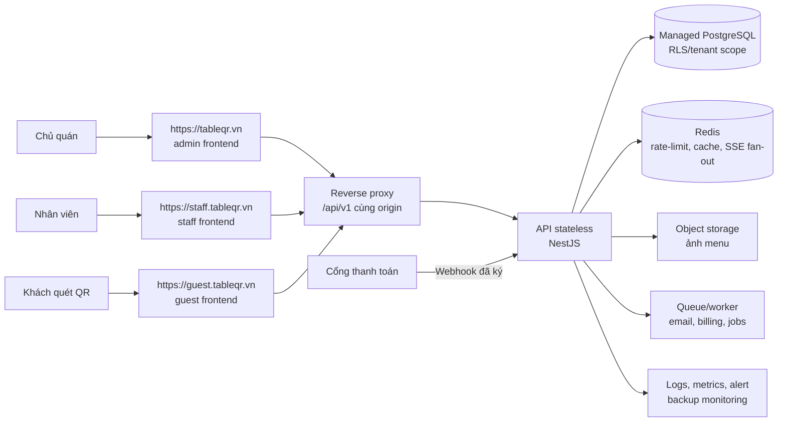
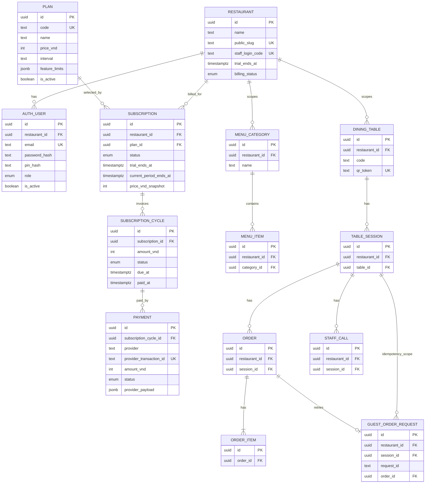
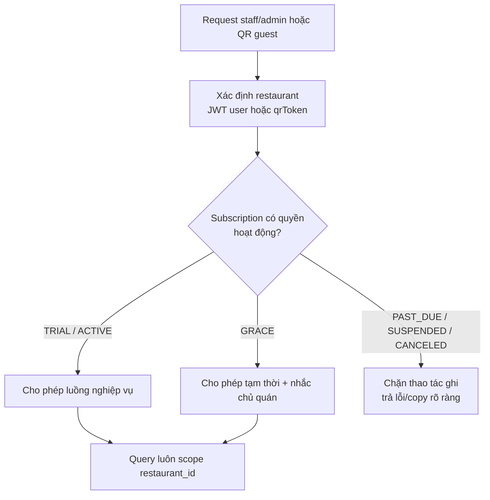

# 10 — Mở rộng SaaS, đa quán và thuê bao

Tài liệu này là thiết kế đích để TableQR phục vụ nhiều chủ quán trên một hệ thống. Theo quyết định người dùng ngày 2026-08-13, local database đã được reset để bắt đầu tenant foundation sớm: dữ liệu nghiệp vụ có `restaurant_id`, JWT mang tenant context, staff ghép tablet bằng QR rồi đăng nhập PIN và SSE scope theo quán. Kiểm tra với hai tenant đã chặn truy cập chéo; guest dùng capability hash thay vì UUID session; PostgreSQL có composite foreign key nên tự chặn quan hệ nghiệp vụ chéo quán; SSE dùng ticket 60 giây thay access JWT trên URL. `SA-03`/`SA-04` vẫn chưa hoàn tất cho đến khi có RLS. Task theo thứ tự tại [../ai-tasks/13-saas-expansion.md](../ai-tasks/13-saas-expansion.md).

## 1. Quy tắc sản phẩm đã chốt

| Nội dung | Quy tắc phiên bản đầu |
| --- | --- |
| Người trả tiền | Chủ quán đăng ký một tài khoản, tạo đúng một quán và là `OWNER` đầu tiên |
| Dùng thử | Miễn phí 2 tháng kể từ khi tạo quán; giai đoạn onboarding lưu `trialEndsAt` cố định trên `Restaurant`, rồi chuyển sang `Subscription` khi làm billing |
| Giá | 100.000 VND/tháng, không giới hạn số đơn |
| Khi hết trial | Chủ quán xem/trả tiền được; quyền vận hành phải theo `Subscription.status` và grace period được cấu hình |
| Khách QR | Không bị yêu cầu đăng nhập; chỉ được tiếp tục gọi món khi quán có quyền hoạt động |
| Tương lai | Giá/gói tính năng được dữ liệu hoá, không hard-code `100000` khắp UI/API |

Để giữ onboarding nhanh ở phiên bản đầu, account được kích hoạt ngay sau đăng ký; chưa có xác minh email. Endpoint đăng ký phải rate-limit nghiêm ngặt và không được làm lộ email đã tồn tại ngoài lỗi `EMAIL_ALREADY_IN_USE`. Xác minh email là hardening sau, không chặn tenant isolation.

**Quy ước đề xuất:** trial là hai tháng lịch (`registeredAt` + 2 tháng) và một quán chỉ được trial một lần. `trialEndsAt` được ghi lúc đăng ký để xử lý đúng tháng ngắn và không đổi nếu kế hoạch giá thay đổi sau này.

**Đã chốt 2026-08-10:** một tài khoản chủ quán quản lý đúng một quán. Mỗi chi nhánh được coi là một quán độc lập với tài khoản, menu, bàn, QR và thuê bao riêng; không có chuyển đổi chi nhánh trong phiên bản đầu.

Các điều cần người quyết trước `SA-01`: cổng thanh toán, có/không grace period và chính sách quán quá hạn (chỉ khoá admin, hay dừng luôn guest order).

## 2. Mục tiêu kiến trúc

Một deployment chung phục vụ nhiều quán độc lập. Mọi truy vấn nghiệp vụ phải có `restaurantId`/tenant context; không được tin ID do frontend gửi mà chỉ lấy tenant từ JWT hoặc QR token. Dùng QR token global unique để xác định quán cho public guest route mà không lộ `restaurantId`.

### Hostname production đã chốt

| Hostname | App | Đường vào chính |
| --- | --- | --- |
| `https://tableqr.vn` | Admin / chủ quán | Đăng ký, đăng nhập, quản lý menu/bàn/quán |
| `https://staff.tableqr.vn` | Staff / bếp | Đăng nhập bằng mã quán + PIN, nhận SSE và xử lý đơn |
| `https://guest.tableqr.vn` | Guest / khách | QR cố định: `https://guest.tableqr.vn/t/<qrToken>` |

Mỗi hostname phục vụ đúng frontend tương ứng và cùng reverse proxy `/api/v1`, `/uploads`, `/menu-images` về một API NestJS. Vì frontend gọi API theo path tương đối (`VITE_API_BASE_URL=/api/v1`), không cần CORS giữa ba subdomain và token của từng app vẫn nằm trong origin riêng. `GUEST_BASE_URL` ở API và `VITE_GUEST_BASE_URL` của admin production đều là `https://guest.tableqr.vn`.

## 3. Mô hình dữ liệu đích

### Một tài khoản, một quán

Phiên bản đầu không có `Organization` hay `Membership`. `AuthUser` có đúng một `restaurant_id`; role `OWNER`/`STAFF` có hiệu lực trong quán đó. Điều này giữ login, JWT, phân quyền và billing đơn giản. Nếu một chủ có nhiều chi nhánh, mỗi chi nhánh đăng ký như một quán độc lập; việc gộp chúng vào một tài khoản là scope tương lai, không phải nợ cần trả ngay.

Mỗi `Restaurant` có một `staff_login_code` ngẫu nhiên, unique toàn hệ thống. Nhân viên đăng nhập bằng mã quán này và PIN dùng chung của quán; mã chỉ để xác định tenant, PIN vẫn là bí mật. Owner nhận mã khi đăng ký và có thể xem lại trong admin để chia sẻ cho nhân viên.

### Bảng/cột sẽ thêm hoặc đổi

| Nhóm | Thay đổi |
| --- | --- |
| Danh tính | Giữ `AuthUser`, thêm `restaurant_id` bắt buộc. Một email/tài khoản thuộc đúng một quán; role hiện tại giữ nguyên. Backfill owner và staff hiện có vào quán mặc định. |
| Tenant | Thêm `restaurant_id` vào `DiningTable`, `MenuCategory`, `MenuItem`, `TableSession`, `Order`, `StaffCall` và bảng idempotency liên quan. Thêm `staff_login_code` global unique vào `Restaurant` để staff xác định quán khi đăng nhập. |
| Uniqueness | Đổi `DiningTable.code` từ global unique sang unique `(restaurant_id, code)`; giữ `qr_token` global unique. Những index đọc thường xuyên bắt đầu bằng `restaurant_id`. |
| Billing | Giai đoạn onboarding chỉ thêm `trial_ends_at` và `billing_status` trên `Restaurant`. `Plan`, `Subscription`, `SubscriptionCycle`, `Payment`, `PaymentWebhookEvent` được tạo ở task billing sau; `Subscription` sẽ gắn trực tiếp với `Restaurant`. Amount là VND integer; lưu `priceVndSnapshot`/`amountVnd`, không đọc lại giá gói cũ. |
| Vận hành | `AuditLog`, thời điểm tạo/cập nhật/soft-delete phù hợp. Không lưu số thẻ hoặc bí mật cổng thanh toán. |

`restaurant_id` được lặp lại trên `Order`/`TableSession`/`StaffCall` dù có thể suy ra qua bàn. Đây là denormalization có chủ đích để tenant filter, index, RLS và audit không phải join dài; API phải tự điền trong transaction, không lấy từ body client.

## 4. Quyền truy cập và billing enforcement

Không chặn mù tất cả GET ngay ngày hết hạn: chủ quán vẫn cần vào xem hoá đơn và thanh toán. Chính sách cụ thể (guest read/order, staff read/write, admin/billing) phải được chốt trong `SA-01`, sau đó thể hiện bằng một `EntitlementService` duy nhất, không rải `if subscription...` trong controller.

Webhook thanh toán phải: xác minh chữ ký, lưu raw event tối thiểu có che dữ liệu nhạy cảm, unique theo `provider_event_id`, xử lý idempotent trong transaction, và chỉ worker/API server-side mới cập nhật subscription.

## 5. Lộ trình migration không downtime lớn

1. **Production foundation:** domain HTTPS ổn định, secrets, backup/restore, object storage và observability trước khi mời quán thật.
2. **Mở rộng additive:** thêm cột nullable `restaurant_id` và backfill toàn bộ dữ liệu hiện có vào quán mặc định. Chưa đổi endpoint.
3. **Dual-read/dual-write có kiểm soát:** service tự lấy tenant context; thêm composite unique/index, kiểm thử không thể đọc chéo tenant. Chỉ bỏ đường cũ sau khi đối soát.
4. **Onboarding:** public owner registration → email/password → restaurant + owner `AuthUser` + `trialEndsAt` cố định trong một transaction. Tạo sẵn menu/bàn mẫu; QR dùng hostname production cố định.
5. **Billing:** seed plan `starter-monthly` 100.000 VND, tạo cycle, tích hợp provider webhook, entitlement + dunning/grace. Đơn không có limit ở policy starter.
6. **Tiered plans:** `feature_limits`/entitlement thay vì hard-code. Migrate plan version/pricing không sửa subscription lịch sử.

Mỗi migration phải có backup, kiểm thử restore, `EXPLAIN` cho các query tenant-scoped, migration rehearsal trên dữ liệu copy, và rollback plan. Không chạy một migration biến đổi toàn bộ bảng lớn trong giờ phục vụ.

## 6. Ngoài phạm vi lần mở rộng đầu

- Không tự thu tiền từ thẻ; dùng cổng thanh toán có webhook.
- Không tính phí theo số đơn ở gói đầu.
- Không mở marketplace/đồng bộ ảnh giữa quán cho tới khi có consent, licensing và object storage chung.
- Không làm một tài khoản quản lý nhiều quán, chuyển đổi chi nhánh hay gộp billing giữa các quán. Mỗi chi nhánh là một quán/tài khoản độc lập.
